## Map of World 

Choropleth of countries by populations

## Install
```bash
$ npm install d3node-map-world
```

## Usage

```js
const d3nMap = require('d3node-map-world');
const map = d3nMap(data, { projectionKey: 'Mercator' })
```

Check out the [example](./example) for usage.

##### Output the example map to an image
```
npm start
```

#### Output (Natural Earth projection):
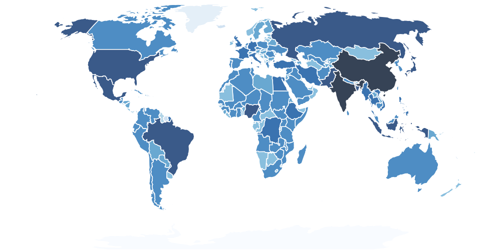

## API

### d3nMap(data, options)

##### data

- Type: `Array`

Delimited data file parsed by d3

#### Options `<Object>`

- projectionKey (default: NaturalEarth)
- width (default: 960)
- height (default: 500)
- colors `Hex, RGB color code`
- colorRanges
- styles


## Other Projections
#### Albers
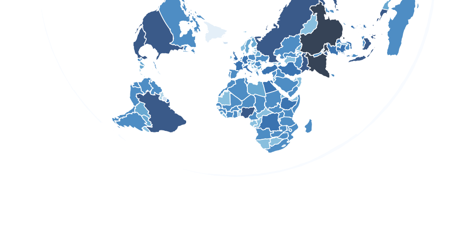
#### Boggs
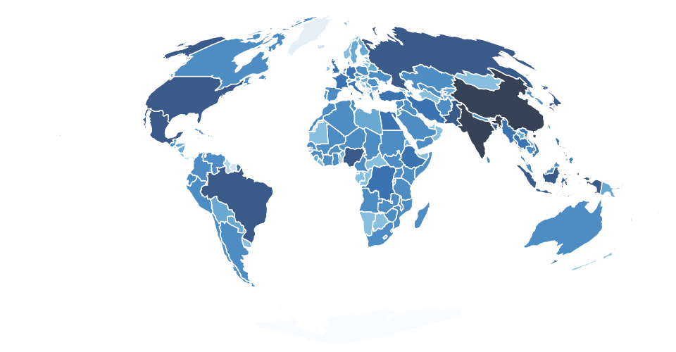
#### Collignon
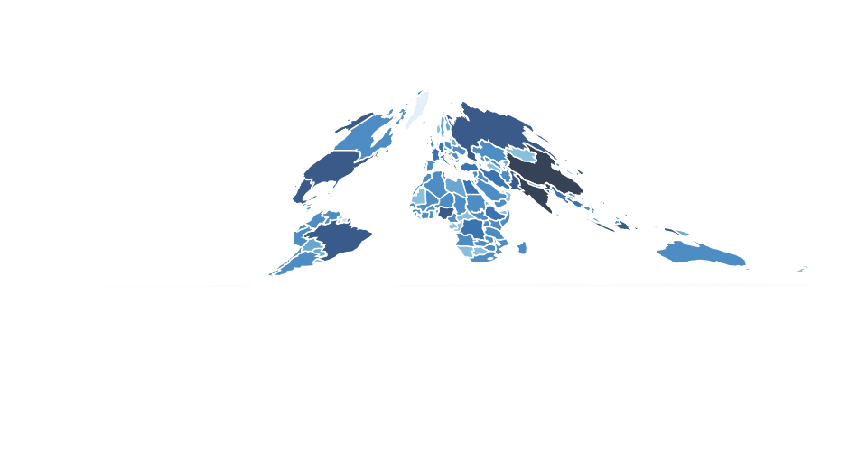
#### CylindricalEqualArea
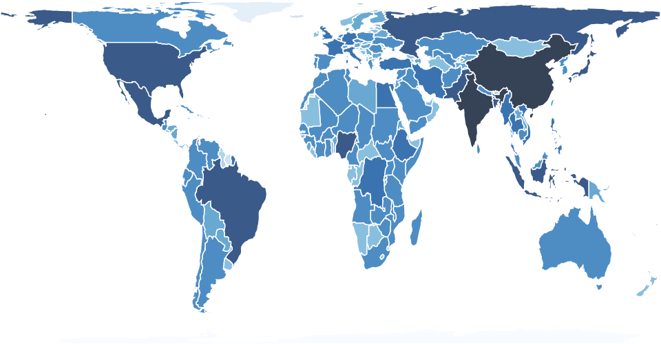
#### Eckert4
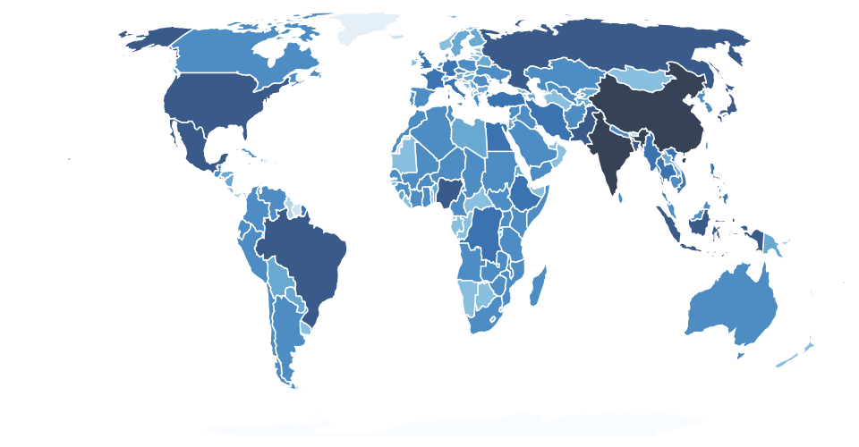
#### Hammer
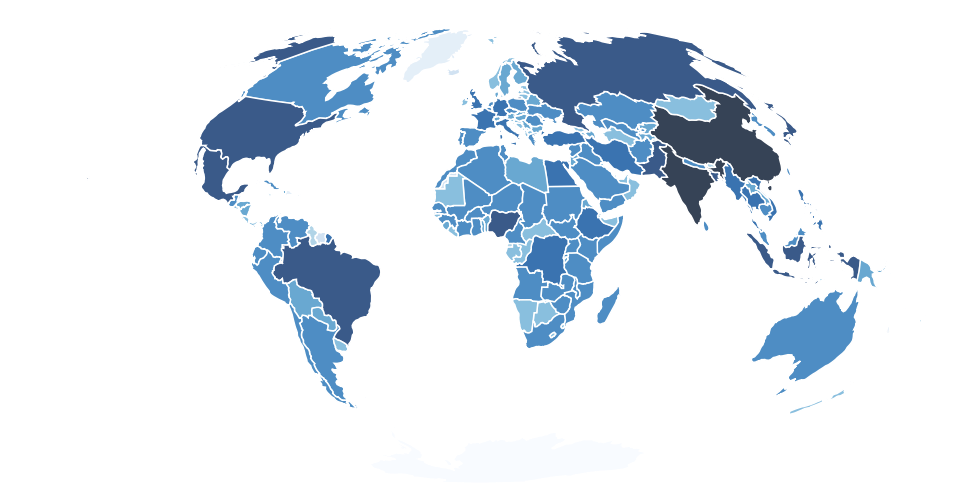
#### Hill
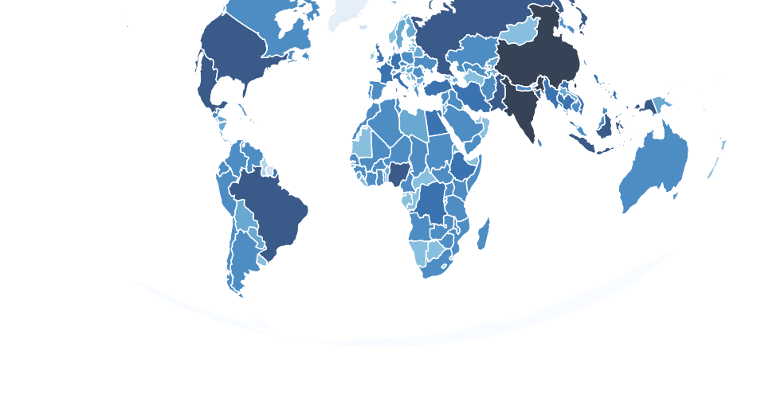
#### Homolosine
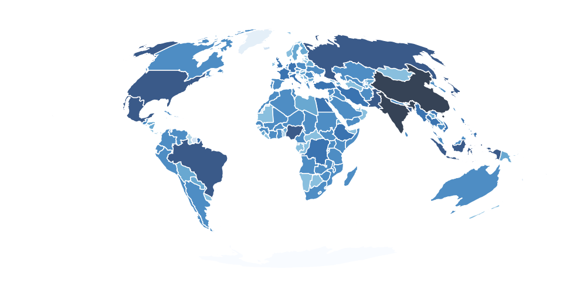
#### Kavrayskiy7
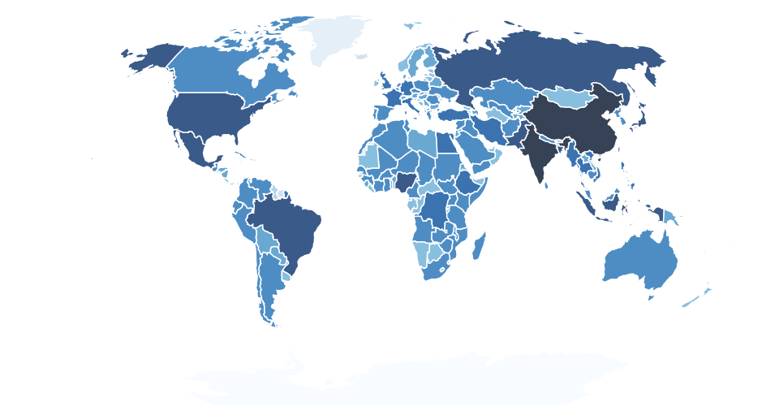
#### Lagrange
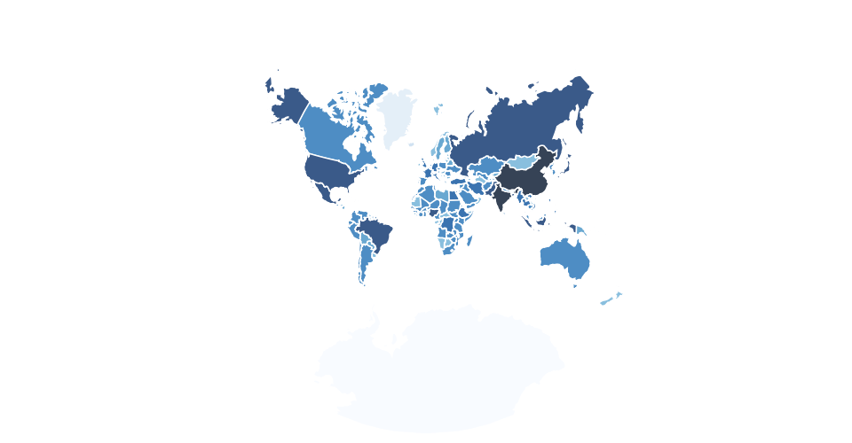
#### Mercator
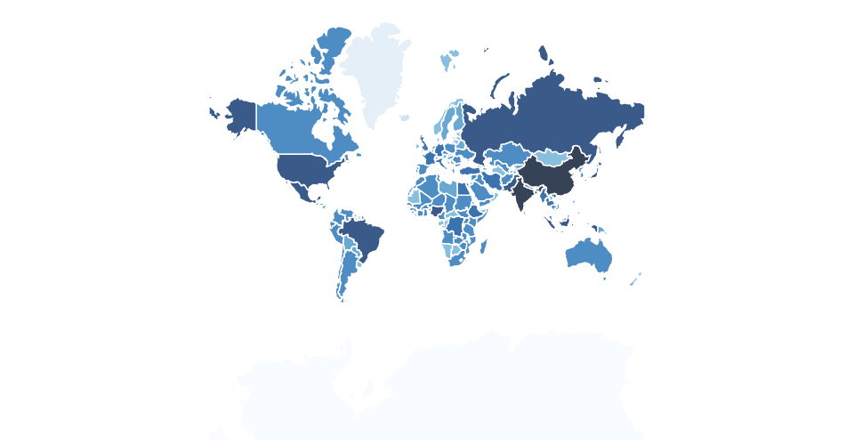
#### Miller
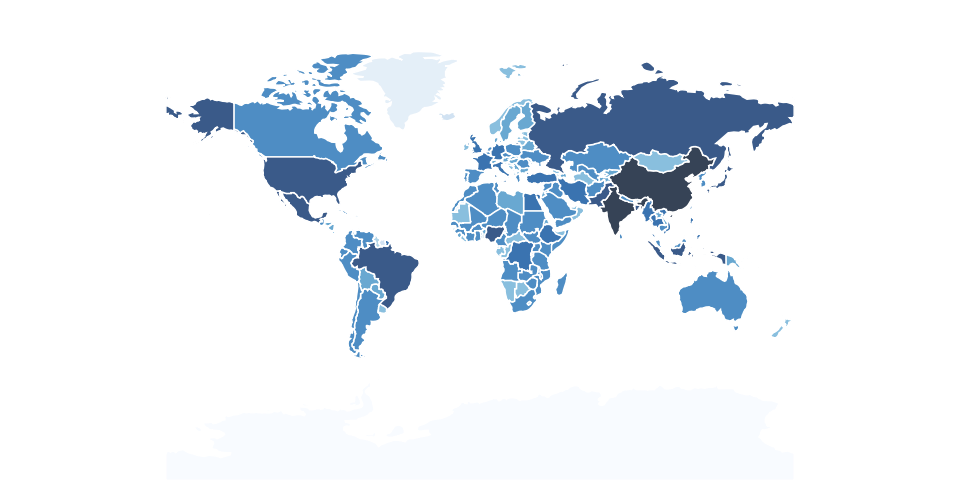
#### Mollweide
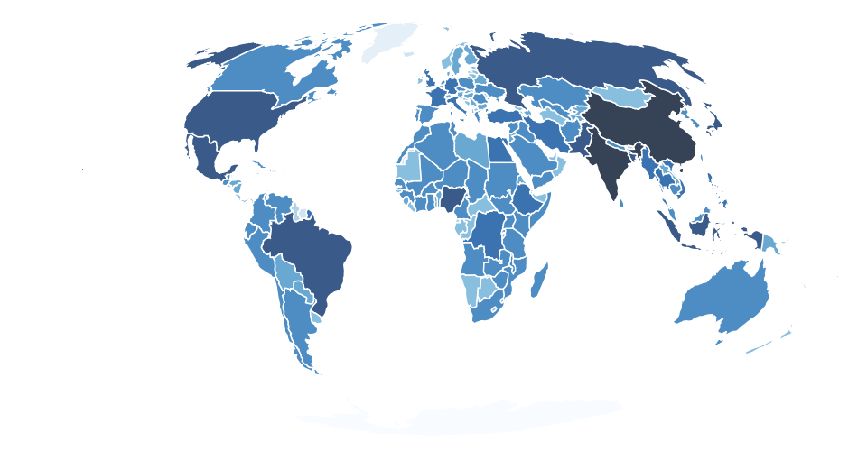


### LICENSE

[MIT](LICENSE) &copy; [d3-node](https://github.com/d3-node)
