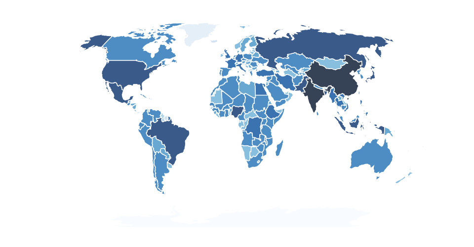

## Map of World 

Choropleth of countries by populations

## Install
```bash
$ npm install d3node-map-world
```

## Usage

```js
const d3nMap = require('d3node-map-world');
const map = d3nMap(data, {})
```

Check out the [example](./example) for usage.

##### Output the example map to an image
```
npm start
```

### Output:


## API

### d3nMap(data, options)

##### data

- Type: `Array`

Delimited data file parsed by d3

#### Options <Object> (optional properties)

##### width = 960 

##### height = 500

##### colors

##### colorRanges

##### styles


## Contributing

1. Fork it!
2. Create your feature branch: `git checkout -b my-new-feature`
3. Commit your changes: `git commit -am 'Add some feature'`
4. Push to the branch: `git push origin my-new-feature`
5. Submit a pull request :D


### LICENSE

[MIT](LICENSE) &copy; [d3-node](https://github.com/d3-node)
